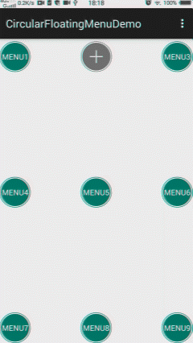
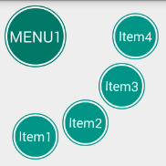
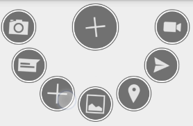
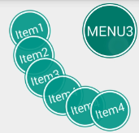
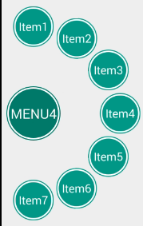
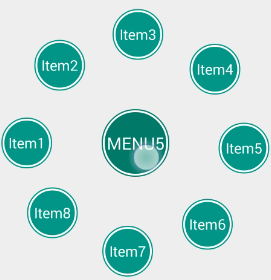
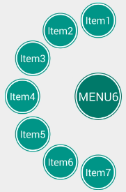
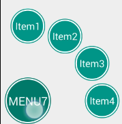
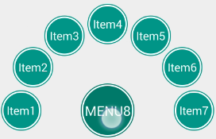
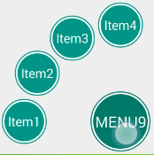

# CircularFloatingMenu


An animated, customizable circular floating menu for Android, inspired by Path app.

### Demo
 demo:<br/>
 
 1. menu1:<br/>

 2. menu2:<br/>

 3. menu3:<br/>

 4. menu4:<br/>

 5. menu5:<br/>

 6. menu6:<br/>

 7. menu7:<br/>

 8. menu8:<br/>

 9. menu9:<br/>


## Getting Started
### Requirements
- API >= 11

### Usage
CircularFloatingMenu can be attached to **any view** in your layout. CircularFloatingMenu is extends RelativeLayout. 

```java
// CircularFloatingMenu attrs
<declare-styleable name="CircularFloatingMenu">
        <attr name="radius" format="reference|dimension"/>
        <attr name="degrees" format="reference|integer"/>
        <attr name="startDegrees" format="reference|integer"/>
        <attr name="isCloseWhenItemClick" format="boolean"/>
    </declare-styleable>
	
```

1 - Create CircularFloatingMenu in layout.xml:
	
eg:
```java
//in layout xml
<com.lybgo.circularfloatingmenu.CircularFloatingMenu xmlns:android="http://schemas.android.com/apk/res/android"
    xmlns:app="http://schemas.android.com/apk/res-auto"
    android:id="@+id/menu2"
    android:layout_width="fill_parent"
    android:layout_height="fill_parent"
    app:degrees="-180"
    app:radius="90dp"
    app:startDegrees="180">

    <ImageView
        style="@style/top_center_item"
        android:src="@drawable/ic_camera_selector" />

    <ImageView
        style="@style/top_center_item"
        android:src="@drawable/ic_chat_selector" />

    <ImageView
        style="@style/top_center_item"
        android:src="@drawable/ic_new_selector" />

    <ImageView
        style="@style/top_center_item"
        android:src="@drawable/ic_picture_selector" />

    <ImageView
        style="@style/top_center_item"
        android:src="@drawable/ic_place_selector" />

    <ImageView
        style="@style/top_center_item"
        android:src="@drawable/ic_send_new_selector" />

    <ImageView
        style="@style/top_center_item"
        android:src="@drawable/ic_video_selector" />
        
	<!-- The last View is Menu button-->
    <ImageButton
        style="@style/menu_btn"
        android:layout_centerHorizontal="true"
        android:background="@drawable/item_image_bg"
        android:src="@mipmap/ic_action_new" />

</com.lybgo.circularfloatingmenu.CircularFloatingMenu>
	
// top_center_item style xml
<style name="top_center_item">
        <item name="android:layout_width">42dp</item>
        <item name="android:layout_height">42dp</item>
        <item name="android:layout_margin">7dp</item>
        <item name="android:layout_centerHorizontal">true</item>
        <item name="android:scaleType">center</item>
        <item name="android:background">@drawable/item_image_bg</item>
</style>
```

2 - Activity:

```java
mMenu2.setOnItemClickListener(new CircularFloatingMenu.OnItemClickListener() {
            @Override
            public void onItemClick(View view, int index) {
                Log.w(TAG,"mMenu2 onItemClick index:" + index);
            }

            @Override
            public void onMenuClick(View view, boolean isOpen) {
                Log.w(TAG,"mMenu2 onMenuClick isOpen:" + isOpen);
                //ViewPropertyAnimator.animate(view).rotation(isOpen?90:0).setDuration(300).start();//Customization Animations of Menu button
            }
        });
 
```

3 - Customization Animations with the items if  there is a need to:

```java
mMenu2.setOnItemTranslationListener(new CircularFloatingMenu.OnItemTranslationListener() {
            Interpolator outInterpolator = new OvershootInterpolator();
            Interpolator inInterpolator = new AnticipateInterpolator();
            float defaultRotation = -180;
            float defaultAlpha = 0f;

            @Override
            public void translationItem(View v, int x, int y, boolean isOpen) {
                if (isOpen) {
                    ViewHelper.setRotation(v, defaultRotation);
                    ViewHelper.setAlpha(v, defaultAlpha);
                }
                Interpolator interpolator = isOpen ? outInterpolator : inInterpolator;
                float toRotation = isOpen ? 0 : defaultRotation;
                float toAlpha = isOpen ? 1 : defaultAlpha;

                ViewPropertyAnimator.animate(v).translationX(x).translationY(y).rotation(toRotation).alpha(toAlpha)
                        .setInterpolator(interpolator).setDuration(500).start();
            }
        });
```
And you're ready to go!


